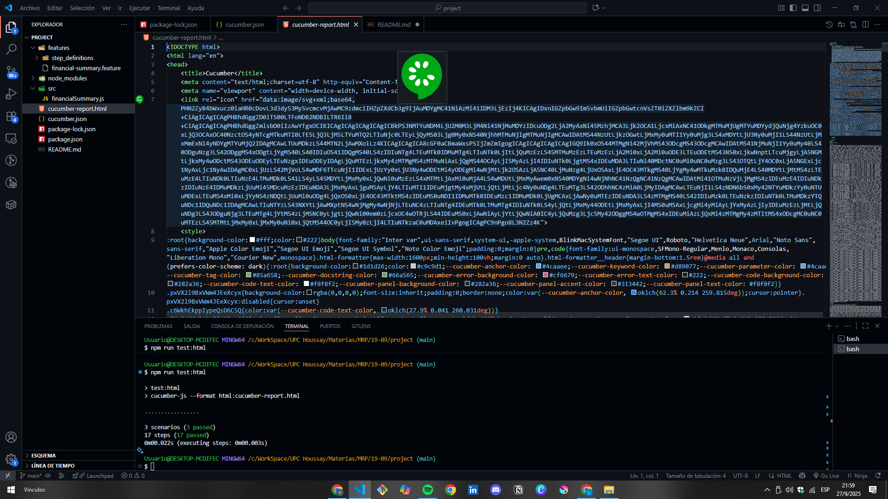
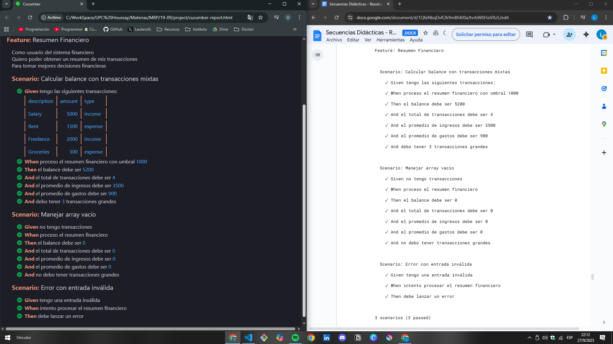

## Hice este repo para que no se les complique tanto y tener que modificar el código como le sucedió al profesor durante la clase. 

* Como sucedió en clase, cuando ejecutemos el test dará error debido a que requiere del módulo ```@babel/register```; para ello el siguiente comando:
```
npm install --save-dev @babel/register @babel/core @babel/preset-env
```

De esta manera no debería dar error al ejecutar 
```
npm run test:html
```



* Para verificar que se haya ejecutado correctamente comparamos con la documentación



A mi tampoco me dan los 21 pasos que se mencionan en el archivo y, por lo que pude averiguar, es debido a que cucumber está agrupando algunos pasos o no los reconoce; o puede ser un error de la IA al generar el código, debido a que en el archivo ```.feature``` si contamos todos los pasos da 17, no 21... en fin, la dejo picando ahí, no se compliquen con esto

Espero que les sea de ayuda 🤔